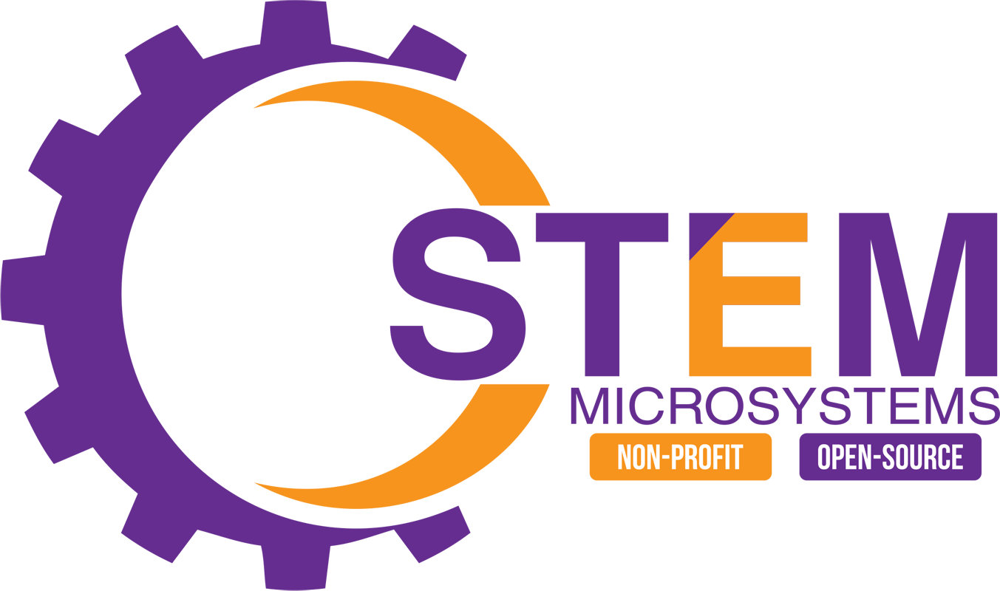

# STEM Microsystems Learning Zone

> You Learn It Here

**Learning Zone** is a cookbook website that accompanies out GitHub repositories, where we store open-source code for our products. This website is alo ment to serve as a step-by-step guide to learn, assemble, maintain and advance our products.  

[GitHub](https://github.com/stem-microsystems)
[Get Started](README.md)

